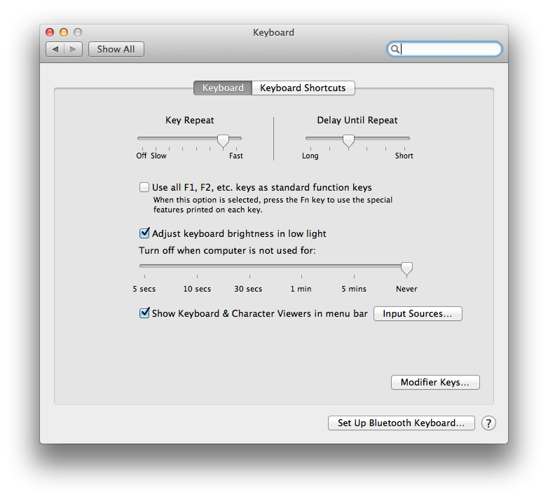

Do you toggle "Use all F1, F2, etc keys as standard function keys" frequnetly?

Now you can do it from alfred itself

Based on answer in https://apple.stackexchange.com/questions/59178/toggle-use-all-f1-f2-as-standard-keys-via-script

