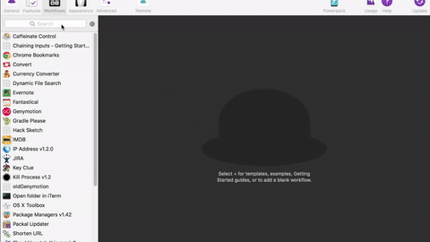

Open Genymotion devices from Alfred.

**Workflows**

1. **!geny** - To launch the pre-selected device name
2. **!geny-list** - Find out list of available device name

**Setup:**

1. !geny-list to find out the list of available device name
2. Note down the device name
3. Open variables screen, set GENY_DEVICE_NAME to your device name, refer the below video for more info
4. !geny to launch the device

